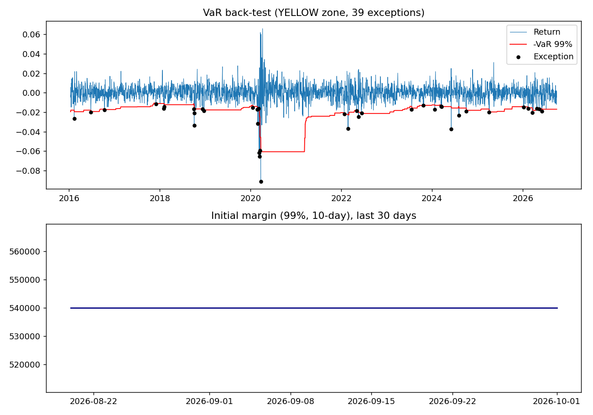
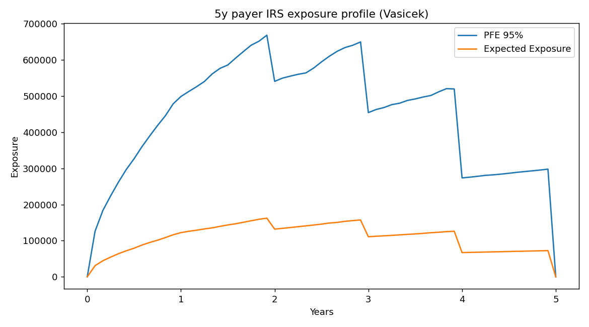

# Portfolio Risk and Margin Engine

A Python risk engine that computes portfolio VaR and Expected Shortfall, back-tests the model, calculates VaR-based initial margin with automated daily commentary, runs scenario stress tests, and simulates Potential Future Exposure (PFE) for an interest rate swap.

Built to mirror workflows in market risk modelling (VaR back-testing, ES) and counterparty credit risk (initial margin, exposure).

## Features

- **Data layer:** historical prices from Yahoo Finance (`yfinance`), stored in SQLite and read back with SQL.
- **Risk models:** 1-day 99% VaR and ES using historical simulation, parametric (normal) and Monte Carlo methods.
- **Back-testing:** rolling 250-day historical VaR, Kupiec proportion-of-failures test, and Basel traffic-light zones.
- **Initial margin:** VaR-based, 99% confidence, 10-day margin period of risk via square-root-of-time scaling.
- **Commentary:** auto-generated day-on-day margin and P&L note.
- **Stress tests:** instantaneous shock scenarios applied to portfolio weights.
- **PFE:** Monte Carlo exposure profile for a 5-year payer swap under a Vasicek short-rate model.
- **Reporting:** multi-sheet Excel report and plots.
- **Tests:** 14 unit tests covering VaR/ES, back-testing, margin scaling and PFE logic.

## Results (real data run)

**Setup:** 2,893 trading days (2 Jan 2015 to 1 Oct 2026), Nifty 50 trading calendar. Notional 10,000,000.

| Asset | Weight |
|---|---|
| RELIANCE.NS | 25% |
| TCS.NS | 20% |
| ^NSEI (Nifty 50) | 30% |
| USDINR=X | 10% |
| LIQUIDBEES.NS | 15% |

**1-day 99% VaR and ES**

| Method | VaR | ES |
|---|---|---|
| Historical | 2.03% | 3.30% |
| Parametric | 1.88% | 2.16% |
| Monte Carlo | 1.88% | 2.16% |

Historical ES is about 53% higher than the normal-model ES, showing that normality understates tail risk (fat tails).

**Back-test (rolling 250-day historical VaR, 99%)**

| Metric | Value |
|---|---|
| Observations | 2,642 |
| Exceptions | 39 (26.4 expected) |
| Last-250-day exceptions | 6 (Basel YELLOW zone) |
| Kupiec LR / p-value | 5.28 / 0.022 (rejected at 5%) |

Exceptions cluster in stress periods: 7 of 39 fall in February and March 2020. A rolling historical window reacts slowly to sudden volatility increases.



**Initial margin and stress tests**

- 99%, 10-day initial margin: about 540,000 (about 5.4% of notional).
- Stress scenarios: "2008-style" shock -2,700,000; rate shock -165,000.

**Swap PFE** (5-year payer swap, notional 10,000,000, 10,000 paths)

- Par fixed rate 6.68%, EPE about 107,000, peak 95% PFE about 669,000 at roughly 1.9 years.
- Exposure rises, then amortizes, with drops at payment dates and zero exposure at maturity.



## Project structure

| File | Purpose |
|---|---|
| `risk_engine.py` | Data loading, VaR/ES, back-testing, margin, commentary |
| `run_report.py` | Runs the pipeline, writes `risk_report.xlsx` and `backtest_plot.png` |
| `pfe.py` | Vasicek swap PFE simulation, writes `pfe_profile.png` |
| `test_risk_engine.py` | Unit tests |
| `check_exceptions.py` | Summarises back-test exceptions by year and month |
| `requirements.txt` | Dependencies |

## How to run

```bash
pip install -r requirements.txt
python run_report.py          # risk report, Excel output, back-test plot
python pfe.py                 # swap exposure profile
python -m unittest -v         # run tests
python check_exceptions.py    # exception clustering summary
```

To change the portfolio, edit `TICKERS`, `WEIGHTS` and the stress scenarios at the top of `run_report.py`. Weight and shock keys must match the ticker names exactly; the code raises an error otherwise. Leave `TICKERS = None` to run on synthetic data without internet.

## Methodology notes

- **Historical VaR:** empirical 1% quantile of portfolio log returns over a rolling 250-day window, using only past data (no look-ahead).
- **Kupiec POF:** likelihood-ratio test of whether the observed exception rate equals 1 - confidence level.
- **Basel zones:** GREEN (0 to 4 exceptions in 250 days), YELLOW (5 to 9), RED (10 or more).
- **Initial margin:** 1-day historical VaR over 500 days scaled by the square root of 10.
- **PFE:** exact Vasicek discretisation, closed-form zero-coupon bond prices, annual resets, floating coupon fixed at the 1-year simple rate on the last reset date. Exposure is `max(MtM, 0)`; PFE is the 95th percentile across paths.

## Limitations

- Square-root-of-time scaling assumes independent returns and can understate multi-day risk in volatile regimes.
- Historical VaR with a 250-day window adapts slowly to volatility spikes. Possible improvements: EWMA-scaled or filtered historical simulation.
- The portfolio is a simple linear-return approximation with static weights, with no option or non-linear products.
- PFE is for a single unmargined trade with no netting or collateral, and the Vasicek parameters are illustrative and not calibrated to market data.
- The initial margin is a simplified VaR-based model, not the ISDA SIMM.
- Yahoo Finance data may be revised and is not suitable for production use.

## Possible extensions

- Filtered historical simulation or EWMA volatility scaling to reduce exception clustering.
- Netting and collateral (variation margin, thresholds) in the PFE module.
- Calibrate the short-rate model to a market yield curve.
- SIMM-style sensitivity-based initial margin.
